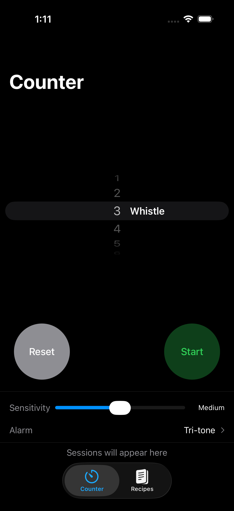
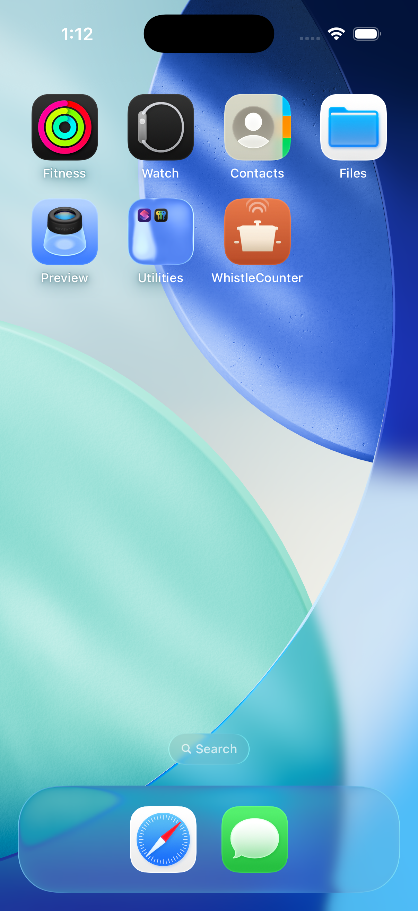

# WhistleCounter

An iOS app that counts pressure cooker whistles using on-device audio
detection. Set a target, tap start, and the app listens for whistles in
the 2–4 kHz band. When it hits your target it plays an alarm and
vibrates the phone so you can walk away from the stove.

Built in SwiftUI with `AVAudioEngine` + `vDSP` for real-time FFT. All
processing is on-device — no accounts, no cloud, no telemetry.

<p align="center">
  
  
</p>

## Features

- **Automatic whistle detection** — FFT-based band-energy detector
  filters out clicks, dropouts, and amplitude wobbles so a single
  long whistle counts as one, not many.
- **Clock-style UI** — scroll wheel to set the target whistle count,
  circular Start/Stop and Reset buttons, session history below the
  counter — all in a dark theme inspired by the iOS Clock app.
- **Recipes** — built-in list of common dishes (rice, dal, rajma,
  curry, chickpeas, potatoes…) with whistle counts. Tap a recipe to
  apply it and start listening in one step. Add, edit, and delete
  your own recipes.
- **Per-recipe alarm sounds** — pick one of five system sounds
  (Tri-tone, Bell, Chime, Glass, Alert) as the global default, or
  override it per recipe. Two-second looping preview in the picker.
- **Session history** — every finished session is saved locally
  (count, duration, recipe name, date) and shown below the counter.
  Swipe-to-delete per row or "Clear all".
- **Audio interruption handling** — if a phone call comes in while
  listening, detection pauses automatically and shows a warning
  banner. When the call ends, listening resumes — no user action
  needed.
- **Looping alarm with haptics** — when the target is reached the
  phone plays the selected sound on a loop with heavy-impact haptics
  and overrides the silent switch, so you'll hear it from across the
  kitchen. Tap OK, Stop, or Reset to silence it.
- **Dark mode** — always-dark UI with a dedicated dark app-icon
  variant and iOS 26 Liquid Glass-style sound wave arcs on the icon.
- **Local-only storage** — recipes and history live in the app's
  sandbox as plain JSON. Uninstall = your data is gone.

## Requirements

- Xcode 16 or later
- iOS 26.0 or later on the device / simulator
- [xcodegen](https://github.com/yonaskolb/XcodeGen) (`brew install xcodegen`)

## Build

```bash
git clone https://github.com/alvisf/WhistleCounter.git
cd WhistleCounter

# Regenerate the .xcodeproj from project.yml
xcodegen generate

open WhistleCounter.xcodeproj
```

In Xcode: pick an iPhone simulator (iPhone 17 Pro works) or your
device, hit ⌘R. On first run you'll be asked for microphone
permission.

Or from the command line:

```bash
xcodebuild \
  -project WhistleCounter.xcodeproj \
  -scheme WhistleCounter \
  -destination 'platform=iOS Simulator,name=iPhone 17 Pro' \
  build
```

## Test

```bash
xcodebuild \
  -project WhistleCounter.xcodeproj \
  -scheme WhistleCounter \
  -destination 'platform=iOS Simulator,name=iPhone 17 Pro' \
  test
```

79 unit tests cover the DSP gate state machine, session state,
history/recipe stores, and alarm-sound routing.

## How detection works

The audio pipeline runs for every buffer the mic delivers:

1. Apply a Hann window to the latest 1024 samples.
2. Real-to-complex forward FFT via `vDSP`.
3. Compute the fraction of spectral power in the **2–4 kHz** band vs.
   total power. That ratio is the "whistle-ness" score.
4. Feed the score into a small state machine (`WhistleGate`) that
   decides when to fire a detection.

The gate has three states (`idle`, `pending`, `firing`) with
configurable thresholds. It only fires when the band-energy stays
above `fireRatio` for at least `minDurationSec`, and won't fire
again until the signal has been below a release threshold
(60% of the fire threshold — hysteresis) for at least
`minGapSec`. That combination ensures a single real whistle is
counted exactly once, even when its amplitude wobbles mid-whistle.

The DSP policy is pure Swift (no audio dependencies) so it's
directly unit-tested against synthetic energy-ratio streams.

## Project layout

```
WhistleCounter/
├── Audio/                  # WhistleDetector protocol + DSP detector
│                           # AlarmPlayer + system sound playback
├── Models/                 # WhistleSession, Recipe, SessionRecord
│   └── Stores/             # JSON-backed recipe + history stores
├── Views/
│   ├── Counter/            # Counter tab (picker + controls + history)
│   ├── Recipes/            # Recipes tab + edit sheet
│   ├── History/            # HistoryTab (legacy, merged into Counter)
│   └── AlarmSoundPickerView.swift
├── Assets.xcassets/        # App icon (any/dark/tinted variants)
└── WhistleCounterApp.swift # App entry
Tools/
├── icon.html               # App icon rendered in CSS
└── generate-icons.sh       # Rasterizes to 1024×1024 PNGs via headless Chrome
```

## App icon

The icon is generated from `Tools/icon.html` and rasterized via
headless Chrome. To regenerate after editing the HTML:

```bash
bash Tools/generate-icons.sh
```

Output goes straight into `WhistleCounter/Assets.xcassets/AppIcon.appiconset/`.

## Status

Personal project — shared publicly for anyone who wants to read the
code or build it themselves. Not published on the App Store yet.

## License

MIT — see [LICENSE](LICENSE).
